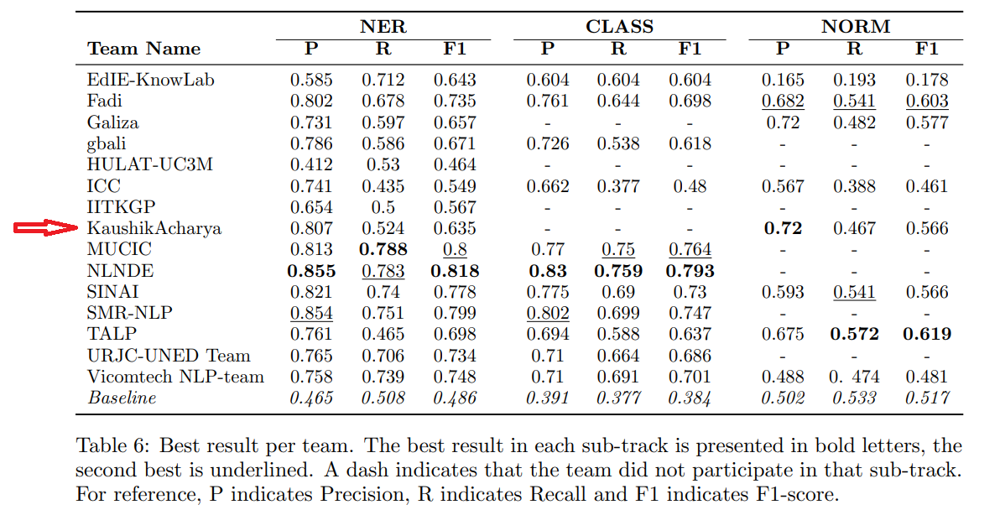

# MEDDOPROF: MEDical DOcuments PROFessions recognition shared task

### Tasks
- **MEDDOPROF-NER**: Named Entity Recognition to extract entities related to occupation and employment status.
- **MEDDOPROF-NORM**: Normalize the entities to codes.

### Algorithms
- NER: Conditional Random Fields (CRF) using hand-crafted features.
- NORM: Vector embedding similarity.

### Shared Task Webpage
https://temu.bsc.es/meddoprof/

### Data
- *Genre*: Medical documents 
- *Language*: Spanish 

#### How to run?
Below are the example commands.

- Train model
    ```python
        python -u -m src.crf --train_model <path_trained_model> --flag_train
    ```
- Predict:
    ```python
        python -u -m src.crf --train_model <path_trained_model> --flag_predict
    ```
- Evaluate
  - Using task organizer's evaluation script:
    
    https://github.com/TeMU-BSC/meddoprof-evaluation-library

  - Token level evaluation using seqeval:
    ```python
        python -u -m src.crf --data_dir  <test_data_dir_with_ground_truth> --train_model <path_trained_model> --flag_evaluate
    ```


### Results
**MEDDOPROF-NER** Micro-average metrics

|  Metrics/Split | Train   |   Test  |
|----------------|---------|---------|
|   Precision    |   0.953 |  0.807  |
|   Recall       |   0.839 |  0.524  |
|   F-score      |   0.892 |  0.635  |


**MEDDOPROF-NORM** Micro-average metrics

|  Metrics/Split | Train   |   Test  |
|----------------|---------|---------|
|   Precision    |   0.956 |  0.720  |
|   Recall       |   0.840 |  0.467  |
|   F-score      |   0.894 |  0.566  |


### Leaderboard


### Task Description Paper
[NLP applied to occupational health: MEDDOPROF
shared task at IberLEF 2021 on automatic
recognition, classification and normalization of
professions and occupations from medical texts by Salvador Lima Lopez et al.](https://rua.ua.es/dspace/bitstream/10045/117495/1/PLN_67_21.pdf)
